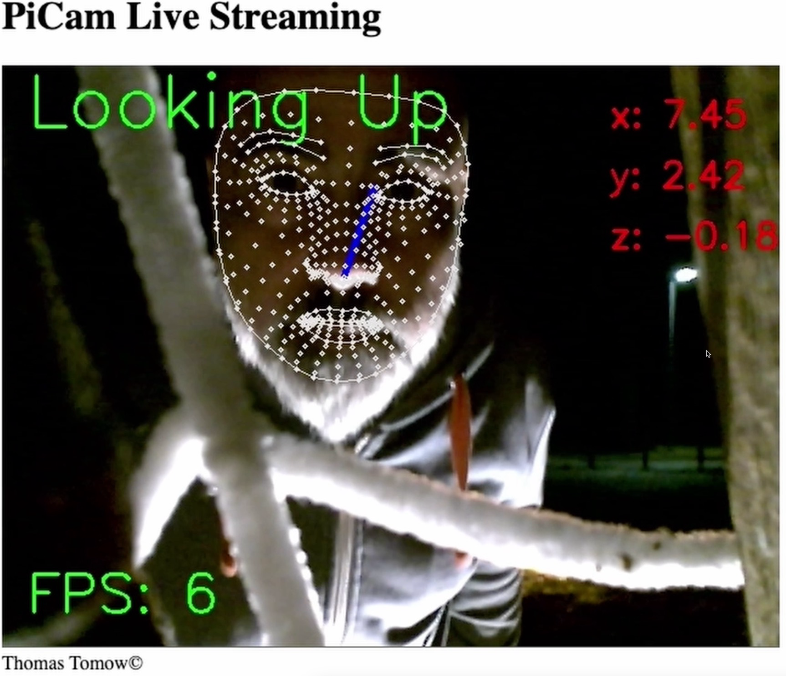
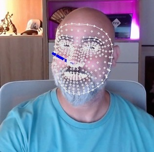

# This project aims to have an 'AI driven Halloween'

|  |  |
| --- | --- |

**Further impression on Youtube: https://youtu.be/AX35HL0cfvc**


## The half of the story
For some years ago I thought about making Halloween a bit more "interactive" than just putting creatures in the yard and let kids walk among them.
There are plenty of nice tools and gimmicks out there, to make the event a special one, but I had an idea to make it more "individual".   
So my idea was having a big monster in the yard that can recognize a child, ask for it's name and when returning somewhen, the monster can call the kid with it's name saying something really scary :-)   
Sadly, I am working for year on it (partially, when time allows), so that I not really finished. I decided now for an interims version, that you can find in here.

## The other half of the story
This here is about detecting a face and finding, if the face ist starring into the camera. In that case, a random monster scream will be played.

## Requirements

You need :
- RaspiPi (mine is 3B+)
- Python3.x (x > 7) installed
- an USB WebCam
- a speaker, that can get really loud

## What to do
### Prepare your PIs hardware
- just attach your USB WebCam to one of the USB ports
- connect your speaker to the 3.5 jack connector
- don't miss power supply

### Prepare your PIs software
(I wrote this readme for headless mode, but it's not different to a terminal session with Desktop)
- `$ sudo apt update`
- clone this https://github.com/totosan/HalloweenFacePi.git
- `$ cd HalloweenFacePi`
- `$ python3 -m pip install -r requirements.txt`
    - this installs **MediaPipe** on youre RasPi; if you're experiencing problems with that, throw an eye to this [https://github.com/superuser789/MediaPipe-on-RaspberryPi](https://github.com/superuser789/MediaPipe-on-RaspberryPi), where installation of MediaPipe is covered 
    - **flask** will be installed to provide a web ui to see, what the camera "sees"
    - **pygame** gets installed to play sound
- **Sounds**:
    *if you look into the file `headPoseEstimation.py`, you will find a list of three wav files in line 20.
    You should ***add your own sound files*** into the main folder and ***put*** their names here ***into the list***.*

- `$ python3 headPoseEstimation.py`
    - this starts the whole thing with the following output:
    ```
    pygame 2.5.2 (SDL 2.28.2, Python 3.11.4)
    Hello from the pygame community. https://www.pygame.org/contribute.html
    * Serving Flask app 'headPoseEstimation'
    * Debug mode: on
    WARNING: This is a development server. Do not use it in a production deployment. Use a production WSGI server instead.
    * Running on all addresses (0.0.0.0)
    * Running on http://127.0.0.1:5000
    * Running on http://xxx.xxx.xxx.xxx:5000
    Press CTRL+C to quit
    * Restarting with stat
    pygame 2.5.2 (SDL 2.28.2, Python 3.11.4)
    Hello from the pygame community. https://www.pygame.org/contribute.html
    * Debugger is active!
    ```
- after this output go to a browser and open the URL of your RasPI with the port 5000 (if didn't changed it) --> http://xxx.xxx.xxx.xxx:5000
- Detection and action starts with opening the website (yeah, could be done also in other ways, but I want to leave that challenge to you)
